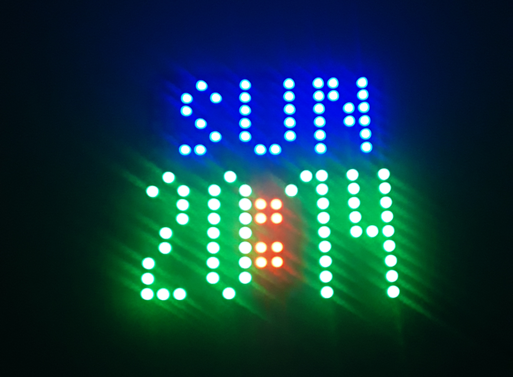

# Make a big ESP32 digital clock
Need a big clock that is easy to read even on bright days? Why not build your own digital clock based on an ESP32. And on top update the time automatically over the internet (NTP time server).

## What do we learn?
- use NeoPixel library to drive a chain of WS2812 RGBW LEDs    
- how to handle multiple WiFi APs with the ESP32 MultiWiFi    
- update the system time with the ESP32 internal NTP client    
- use ESP32 OTA (over the air) update    

## What do we need?
ESP32 e.g. the [HUZZAH32 ESP32 Feather Board Adafruit](https://circuit.rocks/huzzah32-esp32-feather-board-adafruit.html)    
16×16 RGBW LED matrix e.g. the [LED Matrix Flexible 16×16 RGB Gravity](https://circuit.rocks/led-matrix-flexible-16x16-rgb-gravity.html)    
A good 5V power supply e.g. [AC / DC 5V 2.5A Switching Power Supply MicroUSB](https://circuit.rocks/ac-dc-5v-2-4a-switching-power-supply-with-20awg-microusb-cable-raspberry-pi.html)    
[ArduinoIDE](https://www.arduino.cc/en/main/software) or [PlatformIO](https://platformio.org/) with the [ESP32-Arduino framework[(https://github.com/espressif/arduino-esp32) installed to compile the code    
[NeoPixelBus library](https://github.com/Makuna/NeoPixelBus) to control the LED strips    

# Check out the [LEARN](https://learn.circuit.rocks/?p=2353)

